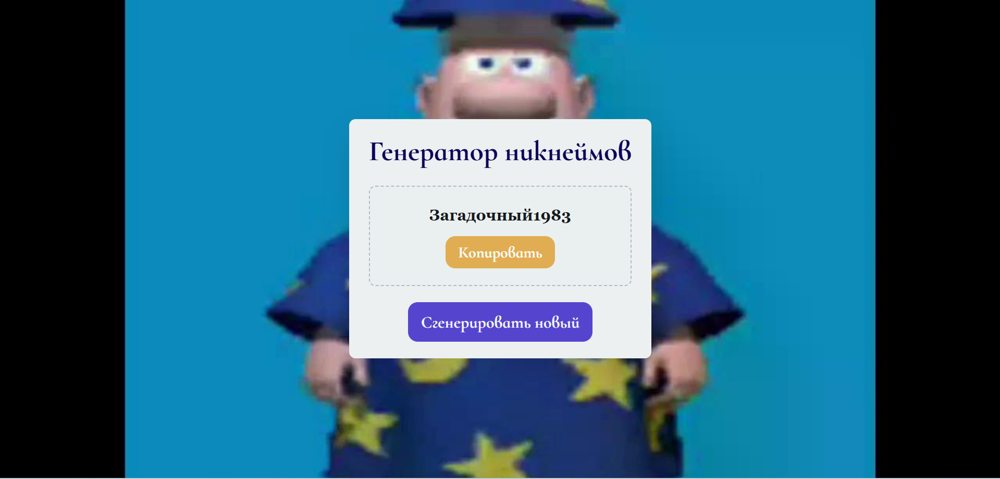
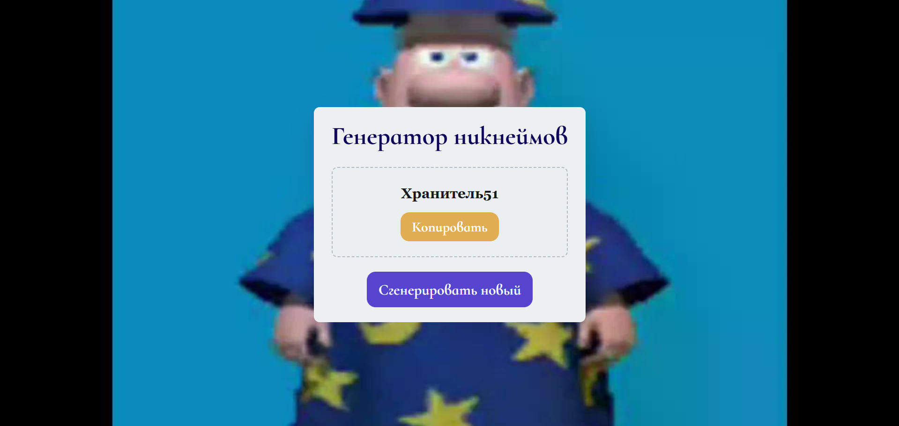
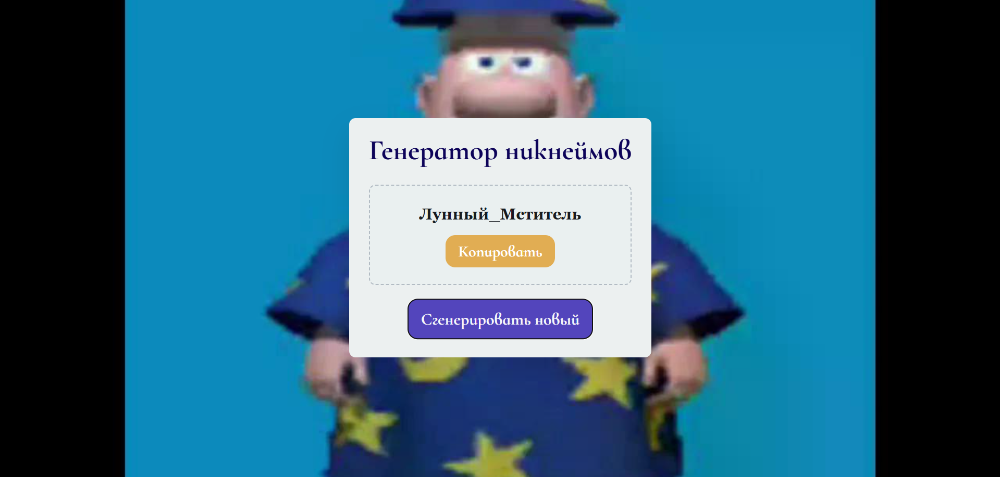
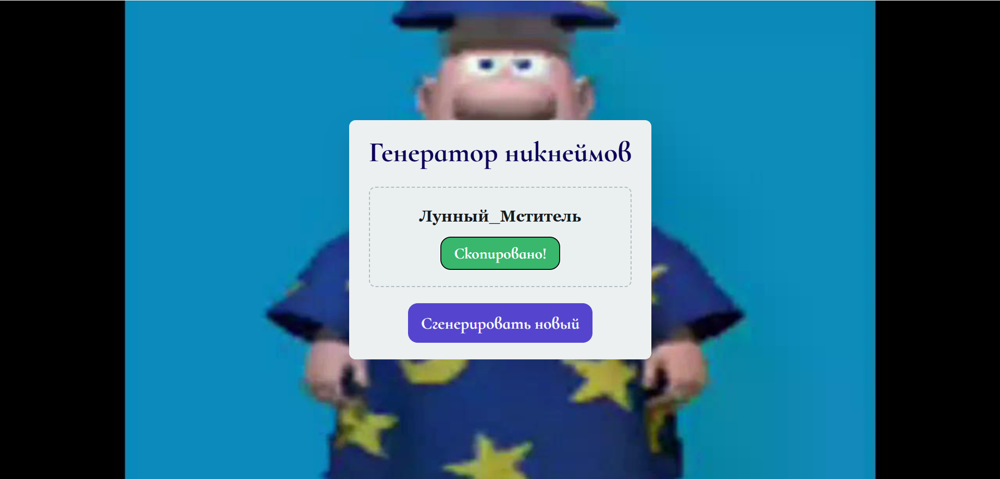
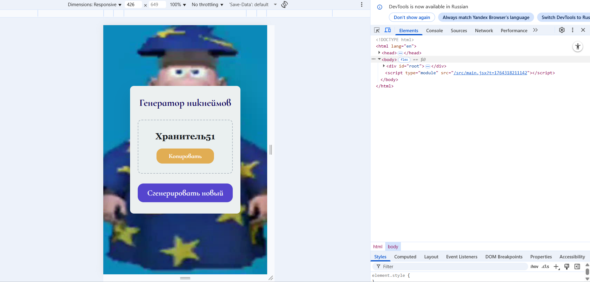

## Описание приложения

Разработанное приложение представляет собой генератор случайных никнеймов для использования в играх, социальных сетях и других онлайн-платформах. 

## Основные возможности и особенности реализации

Приложение генерирует случайные никнеймы путём комбинации префиксов (прилагательных) и суффиксов (существительных), а также случайных чисел в различных форматах.

  

  

  

  

Приложение позволяет мгновенно копировать сгенерированный никнейм в буфер обмена с визуальным подтверждением операции. 

  

Приложение автоматически генерирует первый никнейм при загрузке, демонстрируя пользователю пример работы инструмента. Также реализована адаптивная вёрстка, обеспечивающая корректное отображение на мобильных устройствах и компьютерах.

  

## Выводы

В результате разработки было создано полностью функциональное приложение, отвечающее поставленным требованиям. Полученный генератор никнеймов демонстрирует эффективное использование возможностей React для создания интерактивных веб-приложений.
